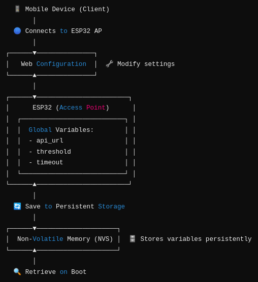
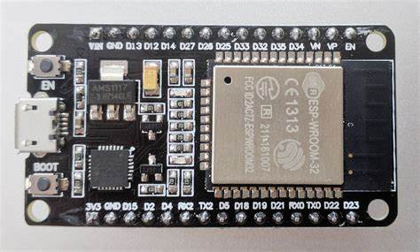

# 🚀 ESP32 Access Point & Configuración Persistente



Este proyecto permite configurar un ESP32 como Access Point (AP) con variables globales almacenadas en memoria, lo que facilita la modificación de valores sin necesidad de reprogramar el dispositivo.

💚 Características

✅ Access Point integrado → Puedes conectarte y configurar el dispositivo desde cualquier otro equipo.
✅ Almacenamiento persistente → Los valores de configuración se guardan en memoria.
✅ Gestión de variables globales → Puedes agregar nuevas variables y recuperarlas sin recompilar el código.


⚙️ Configuración del Access Point

Por defecto, el ESP32 crea una red WiFi con el siguiente nombre y contraseña:
```cpp
String storedSSID = apConfig.getVariable("ssid");          // Nombre del Access Point  
String storedPassword = apConfig.getVariable("password");  // Contraseña del AP  
```
📱 Nombre de la red: ESP_AP_CONFIG🔑 Contraseña: 12345678

Puedes cambiar estos valores al conectarte al AP y modificarlos desde la interfaz de configuración.

🔧 Variables Globales y Almacenamiento Persistente

El código permite gestionar variables globales que se guardan en memoria.

🔹 Declaración de variables globales

```cpp
// Global variables  
String api_url;   
int timeout;     
double threshold;  
```
🔹 Guardar valores por defecto si no existen
```cpp
// Store default values if they do not exist  
apConfig.addVariable("api_url", "http://colecheck/attendance/api/");  
apConfig.addVariable("timeout", "5000");  
apConfig.addVariable("threshold", "3.14");  
```
🔹 Recuperar valores guardados y convertirlos si es necesario
```cpp
// Retrieve stored values and convert them if needed  
api_url = apConfig.getVariable("api_url");  
timeout = apConfig.getVariable("timeout").toInt();  
threshold = apConfig.getVariable("threshold").toDouble();  
Serial.println("Configuration initialized");  
```
📌 Nota: Las variables quedan almacenadas y no se pierden al reiniciar el ESP32.

📶 Configuración de la Red WiFi

El ESP32 también puede almacenar las credenciales de una red WiFi externa para conectarse automáticamente.

🔹 Recuperar SSID y contraseña de la red WiFi guardada
```cpp
String storedwifiSSID = apConfig.getVariable("wifissid");  
String storedwifiPassword = apConfig.getVariable("wifipassword");  
```
Esto permite que el ESP32 se conecte automáticamente a la red configurada sin necesidad de reprogramarlo.

⚖️ Ejemplo Completo en C++

Aquí tienes un ejemplo funcional donde además de las variables anteriores, se agrega la impresión de la hora actual en el ESP32:

```cpp
#include <ESP32-AP-Config.hpp>
#include <ctime>

ESP32AP::Config apConfig;  

// Global variables
String api_url;   
int timeout;     
double threshold;

void setup() {
    Serial.begin(115200);
    apConfig.setupAccesPoint();  

    // Store default values if they do not exist
    apConfig.addVariable("api_url", "http://colecheck/attendance/api/");
    apConfig.addVariable("timeout", "5000");  
    apConfig.addVariable("threshold", "3.14");
    
    // Retrieve stored values and convert them if needed
    api_url = apConfig.getVariable("api_url");
    timeout = apConfig.getVariable("timeout").toInt();  
    threshold = apConfig.getVariable("threshold").toDouble();  
    Serial.println("Configuration initialized");
}

void loop() {
    time_t now = time(nullptr);
    struct tm *timeinfo = localtime(&now);
    char timeString[9];
    strftime(timeString, sizeof(timeString), "%H:%M:%S", timeinfo);

    // Print stored configuration values with timestamp
    Serial.print("[");
    Serial.print(timeString);
    Serial.print("] API_URL: ");
    Serial.print(api_url);
    Serial.print(" | Timeout: ");
    Serial.print(timeout);
    Serial.print(" | Threshold: ");
    Serial.println(threshold);

    delay(2000);
    apConfig.handleClient();  
}
```
🔄 Agregar Más Variables

No estás limitado a solo api_url, timeout y threshold. Puedes agregar más variables según sea necesario. Por ejemplo, para agregar una nueva variable llamada device_mode:
```cpp
// Agregar una nueva variable con un valor por defecto
apConfig.addVariable("device_mode", "automatic");
```
Para recuperarla y utilizarla en el código:
```cpp
String device_mode = apConfig.getVariable("device_mode");
Serial.print("Modo de operación: ");
Serial.println(device_mode);
```
📈 Resumen del Procedimiento

- ⬛️ El ESP32 se enciende y carga las configuraciones almacenadas.

- ⬛️ Si no hay valores previos, usa los valores por defecto.

- ⬛️ El dispositivo inicia un Access Point para permitir la configuración.

- ⬛️ Desde la interfaz web, puedes cambiar valores como:

🛠️ Nombre y contraseña del Access Point

🌐 Dirección de la API (api_url)

⏳ Tiempo de espera (timeout)

🔄 Modo de operación (device_mode)

⬛️ Los cambios se guardan en memoria y persisten tras reinicios.


📚 Conclusión

Este sistema facilita la configuración del ESP32 sin necesidad de reprogramación, permitiendo cambios dinámicos en la red y las variables globales.

## ⚙️ Funcionamiento

1. El ESP32 crea un **Access Point** con un portal web.
2. Desde un dispositivo (PC, móvil), conéctate al WiFi del ESP32.
3. Abre un navegador y accede a `http://192.168.4.1`.
4. Modifica la configuración de WiFi y otros parámetros.
5. Los cambios se guardan en la memoria del ESP32.
6. El ESP32 se reinicia y se conecta a la red configurada.

## 📜 Licencia

Este proyecto está bajo la **licencia MIT**. Puedes usarlo y modificarlo libremente. 🎉

